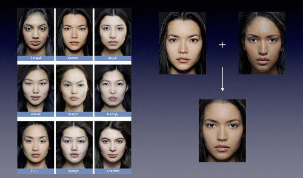
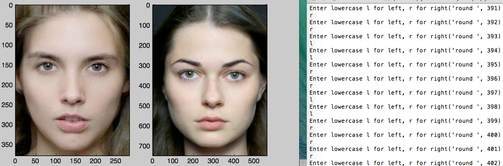
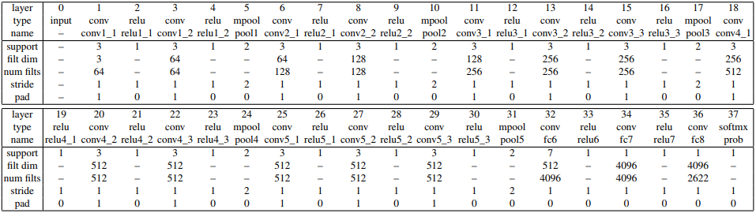
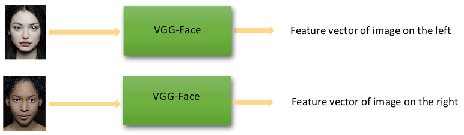

# Transfer Learning with VGG-Face

In this project we used pre-trained VGG-Face to process faces and turn them into feature vectors. We then computed the difference between two feature vectors and use the difference to infer an individual's relative preference for the corresponding two faces.

### Motivation

1. Previous approaches used hand-picked facial features, whereas we process raw image pixels.
2. Previous approaches have studied universal beauty standards with dataset generated by crowd sourcing, whereas we aimed to demystify individual preferences.
3. Previous approaches sought to use beauty scores as labels for classification. We disliked this approach because first the mean and variance of scores for different people are different; and second those metrics can also shift as the same person see more and more faces. Instead of using scores, we used relative preference. Giving an image pair, we recorded which one the individual likes better.

### Data Preparation

109 model faces were collected from the French ["The Ethnic Origins of Beauty"](http://www.lesoriginesdelabeaute.com/fr/accueil.html) project. The photo shoots were multi-ethnic and standardized. To increase the data set we also used a facial average software to produce 76 news faces, each averaged 1:1 from 2 original faces. We then cropped out unnecessary regions, resized to 224 \* 224 \* 3 and subtracted the mean of these 185 images. Unfortunately we can only find female faces from this French project.

The next part of data generation is to collect user preferences. We let the same individual rate his preference for 5000 face pairs. The first 2000 pairs compare an original(non-averaged) face versus another original face, the next 1500 pairs compare an averaged versus original face, and the final 1500 compare an averaged face versus another averaged face. The resulting data is a 5000 \* 3 matrix: the first and second columns store index of each face in the pair, and the third column a binary (0 in favor of first face and 1 in favor of second face). We split the 5000 data labels 4:1 into training and testing set.

<!--  -->

### Feature Extraction

We used pretrained VGG-Face model from [MatConvNet](http://www.vlfeat.org/matconvnet/pretrained/) to extract features from the 185 faces. The network has 37 layers and we experimented with the output 4096 dimensional vector of layer 32 and layer 34, which are the first two of the three fully connected layers. We didn't consider the last one because this network is pretrained on a different dataset and output from last layer is likely to be very tuned towards that dataset. Alternatively we could also fine tune the weights, which I am currently trying. Notice the fully connected layer is labeled as "conv" in the following network structure because "fc" is a special case of "conv".

### Classification

This is the innovative aspect of this project: we use the first feature vector minus the second feature vector as a description of where the first image is relative to the second image in the feature space. We then train classifiers on this directional relative displacement. If the numerical value of a feature is proportional to the size of eyes and the individual who generated the data prefers large eyes, then a positive displacement in that feature dimension will contribute to some favoring over the first image in a pair.

We have trained the difference between two feature vectors with logistic regression and SVM. So far SVM has given superior accuracy of 65%. We realize this result still needs improvement due to the fact we are not fine tuning the network yet. The next step is to borrow the weights of VGG-Face as initialization for a new Siamese network. The network will input two faces at the same time into two parallel branch which share the weights. We will then train fully connected layers on top of the outputs of the two branches to do classification. This should yield way better results and we are working on it.

### More to come!

For more information, you can find me at my [portfolio page](https://yanweiw.github.io/).
Cover photo credit to [The Ethnic Origins of Beauty Project](http://www.lesoriginesdelabeaute.com/fr/accueil.html).
